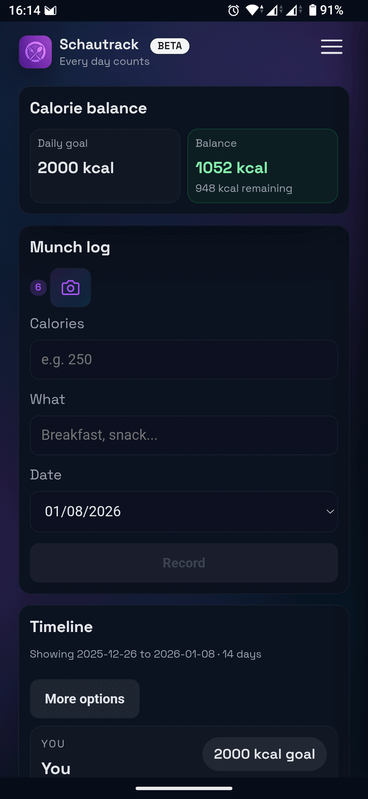
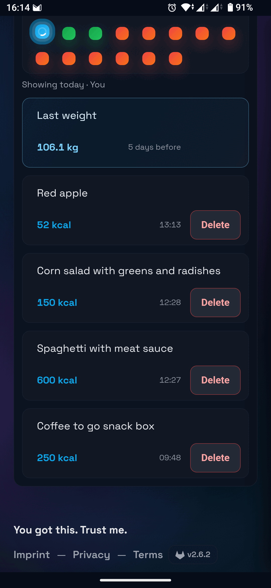
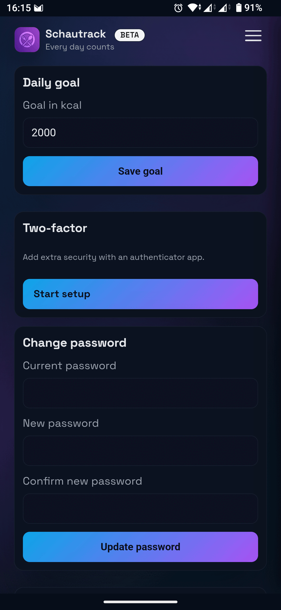

<p align="center">
  
</p>

<h1 align="center">Schautrack Android</h1>

<p align="center">
  The Android app for <a href="https://schautrack.com">Schautrack</a> - a self-hostable, open-source, AI-powered calorie tracker for you and your friends.
</p>

<p align="center">
  <a href="https://play.google.com/apps/testing/to.schauer.schautrack">
    
  </a>
</p>

## About

This is a native Android wrapper for the Schautrack web application. It provides a seamless mobile experience with native features like camera access for food scanning.

By default, the app connects to [schautrack.com](https://schautrack.com), but you can change the server URL on the login screen to use your own self-hosted instance.

## Screenshots

<p align="center">
  
  
  
</p>

## Related Projects

- [Schautrack](https://github.com/schaurian/schautrack)

## Building

```bash
cd android
./gradlew assembleProdDebug
```

## Contributing

Contributions are welcome! See [CONTRIBUTING.md](CONTRIBUTING.md) for guidelines.

## License

AGPL-3.0 - See [LICENSE](LICENSE) for details.
